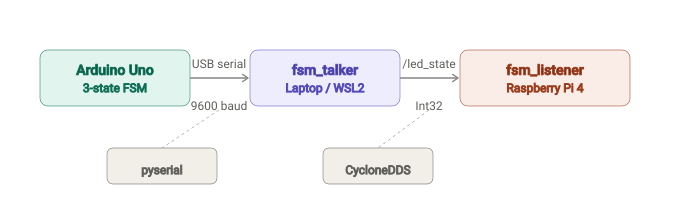
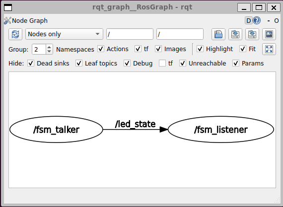

# Arduino FSM → ROS2 Bridge

A distributed ROS2 Jazzy system that bridges an Arduino Uno finite state machine to ROS2 nodes across two networked machines. A pushbutton on the Arduino cycles through three LED states (OFF → ON → BLINK), and the state is published over CycloneDDS to a remote listener running on a Raspberry Pi 4.

> **Arduino firmware:** The FSM sketch running on the Uno lives in a separate repo — [led-fsm-arduino](https://github.com/TheThriftyLog/led-fsm-arduino).

## Architecture



**Talker node** — reads `/dev/ttyACM0` via a 10 Hz timer callback, publishes each state as `std_msgs/Int32` on `/led_state`, and includes retry logic to handle the Arduino's USB-reset behavior on connect.

**Listener node** — subscribes to `/led_state`, maps integer values to human-readable names (`{0: OFF, 1: ON, 2: BLINK}`), and logs state changes.

Both nodes are Python (`rclpy`) packages built with `colcon` and use CycloneDDS (`rmw_cyclonedds_cpp`) for cross-machine discovery.



## Quick Start with Docker

A single Docker image packages both nodes. An entrypoint argument selects which one to run.

```bash
docker build -t fsm-ros2 .
```

Run the **listener** (no hardware required):

```bash
docker run --rm -it --network host fsm-ros2 listener
```

Run the **talker** (requires Arduino on `/dev/ttyACM0`):

```bash
docker run --rm -it --device /dev/ttyACM0 --network host fsm-ros2 talker
```

`--network host` is required so the container shares the host's network interfaces for DDS multicast discovery.

> **Note:** `--network host` works correctly on native Linux (including Raspberry Pi OS). On Docker Desktop for Windows/macOS, the container runs inside a VM and does not have direct access to the host's network interfaces, so cross-machine DDS discovery will not work from a Docker container in that environment. Run natively on those platforms instead.

## Running Without Docker

**Prerequisites:** ROS2 Jazzy, `ros-jazzy-rmw-cyclonedds-cpp`, `python3-serial`, `setuptools==70.0.0`

```bash
# Copy packages into a ROS2 workspace
mkdir -p ~/ros2_ws/src
cp -r src/fsm_talker src/fsm_listener ~/ros2_ws/src/
cd ~/ros2_ws

# Pin setuptools for ROS2 / Python 3.12 compatibility
pip install setuptools==70.0.0 --break-system-packages

# Build
colcon build --symlink-install
source install/setup.bash
```

In separate terminals:

```bash
# Terminal 1 — talker (machine with Arduino attached)
ros2 run fsm_talker fsm_talker

# Terminal 2 — listener (same machine or remote)
ros2 run fsm_listener fsm_listener
```

## Cross-Machine Networking

For the talker and listener to discover each other across machines, both need CycloneDDS configured for the correct network interface.

Create `~/cyclonedds/cyclonedds.xml` on each machine, replacing the interface name with the one carrying your local subnet:

```xml
<?xml version="1.0" encoding="UTF-8"?>
<CycloneDDS xmlns="https://cdds.io/config">
  <Domain>
    <General>
      <Interfaces>
        <NetworkInterface name="wlan0" />
      </Interfaces>
    </General>
  </Domain>
</CycloneDDS>
```

Common interface names: `wlan0` (Pi Wi-Fi), `eth0` (wired), or the mirrored adapter name shown by `ip addr` on WSL2.

Add to `~/.bashrc` on both machines:

```bash
export RMW_IMPLEMENTATION=rmw_cyclonedds_cpp
export CYCLONEDDS_URI=file://$HOME/cyclonedds/cyclonedds.xml
```

## WSL2 Setup Notes

If the talker machine runs Ubuntu under WSL2, two extra steps are needed:

**1. Enable mirrored networking** so WSL2 shares the host's network interfaces instead of sitting behind NAT. Create `C:\Users\<username>\.wslconfig`:

```ini
[wsl2]
networkingMode=mirrored
firewall=false
dnsTunneling=true
```

Then restart WSL (`wsl --shutdown` from PowerShell).

**2. USB passthrough** for the Arduino requires [`usbipd-win`](https://github.com/dorssel/usbipd-win). After installing, from an admin PowerShell:

```powershell
usbipd bind --busid <BUSID>
usbipd attach --wsl --busid <BUSID> --auto-attach
```

Find your Arduino's `BUSID` with `usbipd list`.

## Hardware

- Arduino Uno R3
- Momentary tactile pushbutton
- 5mm LED with 220Ω current-limiting resistor
- 10kΩ pull-down resistor (button)
- Breadboard and jumper wires
- Raspberry Pi 4 (listener target)

## FSM State Table

| State | Value | LED Behavior            |
|-------|-------|-------------------------|
| OFF   | 0     | LED off                 |
| ON    | 1     | LED on                  |
| BLINK | 2     | LED toggles every 500ms |

Each button press advances: 0 → 1 → 2 → 0.

## Key Dependencies

| Dependency | Why |
|---|---|
| ROS2 Jazzy | Base framework |
| `rmw_cyclonedds_cpp` | DDS implementation for cross-machine discovery |
| `python3-serial` (pyserial) | Serial communication with Arduino |
| `setuptools==70.0.0` | Pinned for ROS2 / Python 3.12 compatibility |

## Related

- [led-fsm-arduino](https://github.com/TheThriftyLog/led-fsm-arduino) — Arduino firmware for the pushbutton FSM

## Author

Logan | [GitHub](https://github.com/TheThriftyLog)
